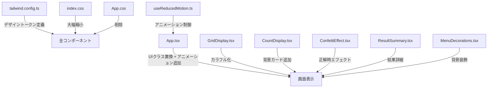

# 技術設計ドキュメント: UIデザイン洗練化

## 概要

「みなトレ」アプリのビジュアルデザインを洗練させるリファクタリング。現行の `index.css` に集中したカスタムCSSを Tailwind CSS 4 のユーティリティクラスとデザイントークンに段階的に移行し、同時にメニュー画面・問題画面・結果画面のビジュアルとインタラクションを子ども向けに強化する。

### 設計方針

- **段階的移行**: `index.css` のカスタムCSSを一度に全削除せず、コンポーネント単位で Tailwind クラスに置き換える
- **既存構造の維持**: App.tsx の画面切り替えロジック（メニュー→問題→結果）はそのまま活用し、UIレイヤーのみ改善
- **Framer Motion 活用**: 既に導入済みの Framer Motion をマイクロアニメーションに全面活用
- **新規依存なし**: 紙吹雪等のエフェクトは CSS + Framer Motion で自作し、外部ライブラリを追加しない

## アーキテクチャ

### 現行構造と変更方針

```
src/
├── App.tsx                    # メイン画面（リファクタリング対象）
├── App.css                    # 削除予定（内容をTailwindに移行）
├── index.css                  # 大幅縮小（Tailwind設定に移行）
├── main.tsx                   # 変更なし
├── components/
│   ├── GridDisplay.tsx         # カラフル化リファクタリング
│   ├── CountDisplay.tsx        # 背景カード追加
│   ├── ConfettiEffect.tsx      # 新規: 紙吹雪アニメーション
│   ├── ResultSummary.tsx       # 新規: 結果画面サマリー
│   └── MenuDecorations.tsx     # 新規: メニュー背景装飾
├── hooks/
│   ├── useLocalStorage.ts      # 変更なし
│   └── useReducedMotion.ts     # 新規: prefers-reduced-motion対応
├── store/
│   └── types.ts                # 変更なし
└── assets/
    └── data/questions.ts       # 変更なし
```

### 変更の影響範囲



## コンポーネントとインターフェース

### 1. デザイントークン（tailwind.config.ts）

Tailwind CSS 4 の設定ファイルにデザイントークンを一元定義する。

```typescript
// tailwind.config.ts に追加するトークン
{
  theme: {
    extend: {
      colors: {
        // 既存のprimary/success/warningに加えて
        bg: { warm: '#fff8e8', cool: '#e8f7ff' },
        surface: '#ffffff',
        ink: '#1e293b',
        muted: '#475569',
        line: '#cfe3ff',
        brand: { DEFAULT: '#0ea5e9', strong: '#0284c7' },
        accent: '#f97316',
        ok: '#16a34a',
        warn: '#b45309',
        // グリッドセル用パステルカラー
        cell: {
          blue: '#93c5fd',
          green: '#86efac',
          pink: '#f9a8d4',
          yellow: '#fde68a',
        },
      },
      fontFamily: {
        kid: ["'Hiragino Maru Gothic ProN'", "'Nunito'", "'Yu Gothic'", 'sans-serif'],
      },
      borderRadius: {
        card: '26px',
        btn: '18px',
        option: '16px',
      },
      boxShadow: {
        card: '0 14px 34px rgba(2, 132, 199, 0.12)',
        btn: '0 9px 18px rgba(22, 163, 74, 0.26)',
        'btn-blue': '0 9px 18px rgba(2, 132, 199, 0.24)',
      },
    },
  },
}
```

### 2. ConfettiEffect コンポーネント（新規）

正解時の紙吹雪アニメーション。Framer Motion の `motion.div` で複数のパーティクルを生成する。

```typescript
interface ConfettiEffectProps {
  isActive: boolean;       // 表示トリガー
  particleCount?: number;  // パーティクル数（デフォルト: 20）
  duration?: number;       // アニメーション時間（デフォルト: 1500ms）
}
```

**実装方針**:
- `useMemo` でパーティクルの初期位置・色・回転をランダム生成
- `motion.div` の `animate` で落下 + 回転アニメーション
- `useReducedMotion` が true の場合はパーティクル数を0にする
- `pointer-events: none` で操作を妨げない

### 3. ResultSummary コンポーネント（新規）

結果画面の問題別正誤サマリー。

```typescript
interface ResultSummaryProps {
  answers: UserAnswer[];
  questionMap: Map<string, QuestionData>;
}
```

**表示内容**:
- 各問題のタイトル + ◯/△アイコン
- 正答率に応じた称号テキスト
- カウントアップアニメーション（スコア数字）

### 4. MenuDecorations コンポーネント（新規）

メニュー画面の背景装飾要素。

```typescript
interface MenuDecorationsProps {
  // props不要、純粋な装飾コンポーネント
}
```

**実装方針**:
- パステルカラーの丸・星をランダム配置
- `position: absolute` + `pointer-events: none` でレイアウトに影響しない
- Framer Motion でゆっくりした浮遊アニメーション
- `useReducedMotion` が true の場合は静止表示

### 5. useReducedMotion フック（新規）

```typescript
function useReducedMotion(): boolean
```

`window.matchMedia('(prefers-reduced-motion: reduce)')` を監視し、アニメーション軽減設定の状態を返す。

### 6. GridDisplay リファクタリング

**変更点**:
- 塗りつぶしセルの色を `#333`（黒）からパステルカラー（`cell.blue` 等）に変更
- セルの角を丸くする（`rx`, `ry` 属性追加）
- セル間の余白を追加（gap を SVG 内で表現）
- 「おてほん」ラベルに装飾（背景バッジ + アイコン）

### 7. App.tsx リファクタリング

**変更点**:
- カスタムCSSクラス → Tailwind ユーティリティクラスに置換
- メニュー画面: 選択ボタンに絵文字追加、スタートボタンのグラデーション強化
- 問題画面: 選択肢のタップアニメーション追加（`whileTap={{ scale: 0.95 }}`）
- 結果画面: スコアカウントアップ、称号表示、サマリーセクション追加
- フィードバック: 正解時に ConfettiEffect 表示、◯マークのポップインアニメーション

## データモデル

既存のデータモデル（`store/types.ts`）に変更なし。UIレイヤーのみの改善のため、型定義・状態管理・問題データはすべて現行のまま維持する。

結果画面の称号ロジックは App.tsx 内のヘルパー関数として実装する:

```typescript
function getResultTitle(score: number, total: number): { text: string; emoji: string } {
  const rate = total > 0 ? score / total : 0;
  if (rate === 1) return { text: 'パーフェクト！すごい！', emoji: '🏆' };
  if (rate >= 0.8) return { text: 'とっても よくできました！', emoji: '⭐' };
  if (rate >= 0.5) return { text: 'がんばったね！', emoji: '😊' };
  return { text: 'もういちど やってみよう！', emoji: '💪' };
}
```

## エラーハンドリング

本機能はUIデザインの改善であり、新たなエラーパスは発生しない。既存のエラーハンドリング（localStorage の try-catch、questionMap の undefined チェック等）はそのまま維持する。

考慮すべき点:
- **アニメーションフォールバック**: `useReducedMotion` が true の場合、すべてのアニメーションを即時表示に切り替える
- **フォントフォールバック**: `Hiragino Maru Gothic ProN` が利用できない環境では `Nunito` → `Yu Gothic` → `sans-serif` にフォールバック
- **SVGレンダリング**: GridDisplay のパステルカラーが表示されない場合のフォールバック色を設定

## テスト戦略

### PBTの適用判断

本機能はUIデザインの洗練化（CSS移行、アニメーション追加、レスポンシブ対応）が中心であり、プロパティベーステストの対象外である。理由:

- 入力に対する出力が「視覚的な見た目」であり、普遍的な性質を定義しにくい
- テスト対象がCSSクラス・アニメーション・レイアウトであり、純粋関数ではない
- UIレンダリングはスナップショットテストやビジュアルリグレッションテストが適切

### テストアプローチ

**1. ユニットテスト（Vitest）**
- `getResultTitle()` 関数: 正答率に応じた称号の正しさを検証
- `useReducedMotion` フック: メディアクエリの監視動作を検証
- ConfettiEffect: `isActive=false` 時にパーティクルが生成されないことを検証

**2. コンポーネントテスト（Vitest + React Testing Library）**
- GridDisplay: パステルカラーの `fill` 属性が正しく設定されることを検証
- ResultSummary: 正誤アイコン（◯/△）が正しく表示されることを検証
- メニュー画面: 絵文字・アイコンが選択ボタンに表示されることを検証
- アクセシビリティ: `aria-label`、`aria-live` 属性の存在を検証

**3. ビジュアル確認（手動）**
- 320px / 768px / 1024px の各画面幅でレイアウト崩れがないことを確認
- `prefers-reduced-motion: reduce` 設定時にアニメーションが軽減されることを確認
- iPad実機でタップ操作・アニメーションの動作を確認
- WCAG 2.1 AA コントラスト比の確認（DevTools の Lighthouse 等）

**4. ビルド検証**
- `npm run build` が成功すること
- `npm run lint` がエラーなしで通ること
- 未使用のCSSカスタムプロパティが残っていないことを確認
